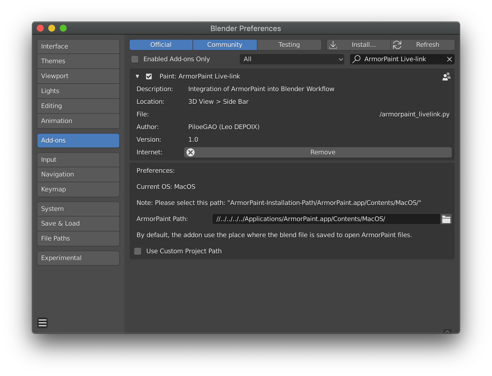
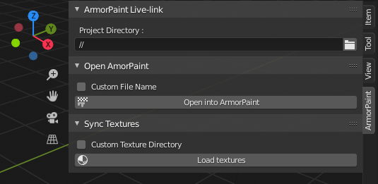

# Blender ArmorPaint Livelink

This addon is the current implementation of live link for [ArmorPaint](armorpaint.org) inside of Blender 2.8+

**Figure 1** - Addon Properties

**Figure 2** - Addon tab in the 3D View

## Getting Started

### Prerequisites

Download latest version of Blender (v. 2.80 minimum) and the latest version of ArmorPaint.

### Installing

1. Clone the repository  
2. Inside of Blender, *Edit > Preferences... > Add-ons (Tab) > install..* the armorpaint_livelink.py file  
3. Turn on the addon  
4. Add the ArmorPaint executable path in the "ArmorPaint Executable" field  
5. In the 3D View, open the panel side (*N* shortcut) and locate the project directory  (folder where your Arm file and textures will be saved)  
6. Select your object  (he needs to be unwrapped) and click on the "Open in ArmorPaint" to edit it inside of ArmorPaint  (* Optionnal:You can use a custom arm name instead of the object name - example: Use "MyBeautifullCube.arm" for the "Cube" object instead of "Cube.arm"*)  
7. When the texturing process is done, export your textures to a subdirectory called "exports" (* Optionnal: You can also use a custom directory for your textures - example: "/highdefTextures/"*)

## Contributing

Please read [CONTRIBUTING.md](https://gist.github.com/PurpleBooth/b24679402957c63ec426) for details on our code of conduct, and the process for submitting pull requests to us.

## Authors

* **Léo DEPOIX** - *Initial work* - [PiloeGAO](https://github.com/PiloeGAO)
* **Spirou4D** - *Code fix* - [Spirou4D](https://github.com/Spirou4D)

See also the list of [contributors](https://github.com/your/project/contributors) who participated in this project.

## License

This project is licensed under the GNU GPLv3 License - see the [LICENSE.md](LICENSE.md) file for details
